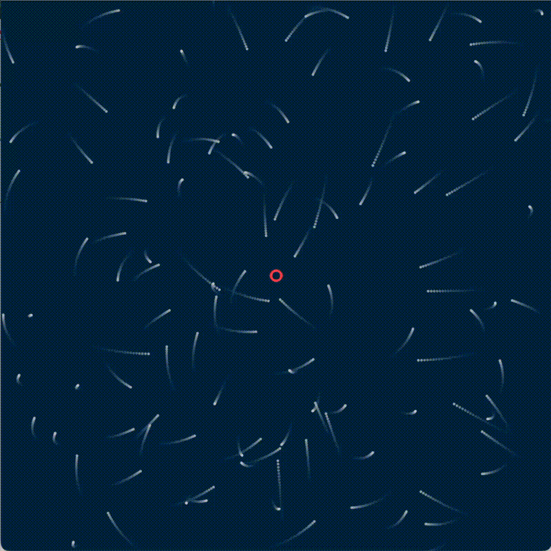

# 002 Particle Orbits:

With this sketch we expand the concepts seen on the previous one by creating interactive forces.
All the particles are attracted to a central point, in a chain that takes us from force -> acceleration -> velocity -> position

## Concepts:
- Vectors
- Velocity
- Fading trails
- Acceleration
- Forces

## Controls:

- This is not an interactive sketch
